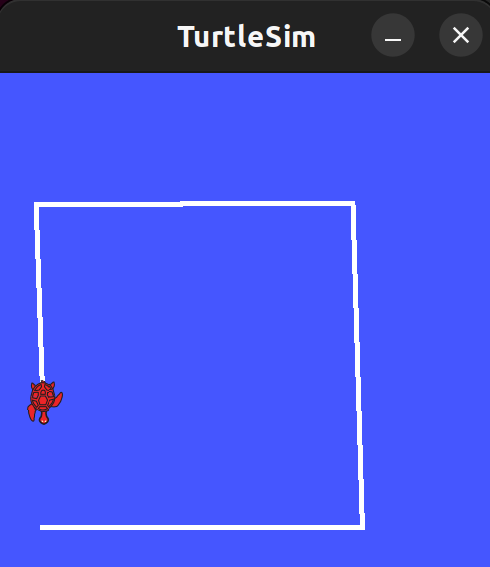

# demo-ros1-turtlesim
## Overview: a development environment for demontrating the Artefact platform with ROS 1.

For maximum simplicity, this demo uses the turtlesim simulator.

To demonstrate a foundational robotics use case, this demo implements the computation of the trajectory of the turtle, similar to any robot's odometry.

Artefact strives to enable managing and automating the entire lifecycle of robot feature development. The following lifecycle features are implemented in this demo:

After a one-time investment into setting up appropriate configurations (the artefact client and one .yaml config file), the functions in this diagram are all automated by artefact and launched with a single command by the user:
- **Stand-up simulation:** the turtlesim simulator is launched
- **Setup Test Params:** User-specified test-specific test parameters are reflected in the simulator, e.g. the turtle is teleported to the starting position
- **Start Test**: User-specified test commands are executed
- **Record Data**: During the test, data e.g. published ROS topics are recorded in a ROSbag.
- **Compute metrics**: During the test, additional nodes to compute metrics are executed
- **Stop Test**: User-specified test stop criteria or timeout defines the end of the tests and processes exit gracefully
- **Post Process**: User-specified post-processing script runs. Currently, its input is the ROSbag of recorded data. The output can be any file (e.g an html figure)
- **Log Results**: All artifacts created during the test are uploaded to the cloud and displayed in a Dashboard. E.g the ROSbag can be conveniently downloaded for future analysis / html figures are rendered. A share-able link can be used to invite collaborators to view test results.
- **Iterate tests over several parameters**: Parameters in the .yaml config file can be specified as a list of possible values. Then all of the above process will run for each combination of the parameters (grid search). All the data from each test will be automatically viewable in the cloud Dashboard.

For more insight into how artefact simplifies manual robotics development tasks see [TODO](https://TODO)
